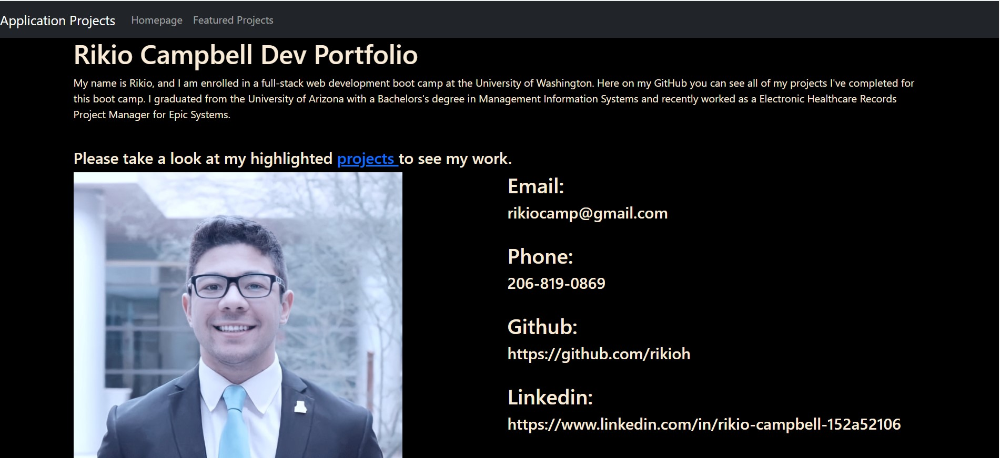

# Portfolio

**Name**: Rikio's portfolio

Description and usage: This application is to be used to view my public coding portfolio. The website will show my professional headshot and professional sites. This site also includes a download for my resume and three links to project pages.

**Visuals**:  This image shows the example of the app in use.

**Technologies used**: HTML, CSS

**Link to deployed application**: https://rikioh.github.io/portfolio/

